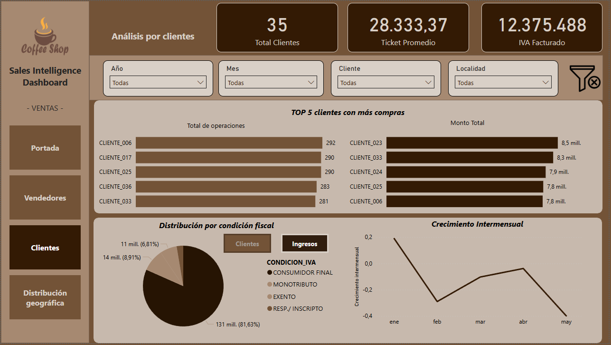
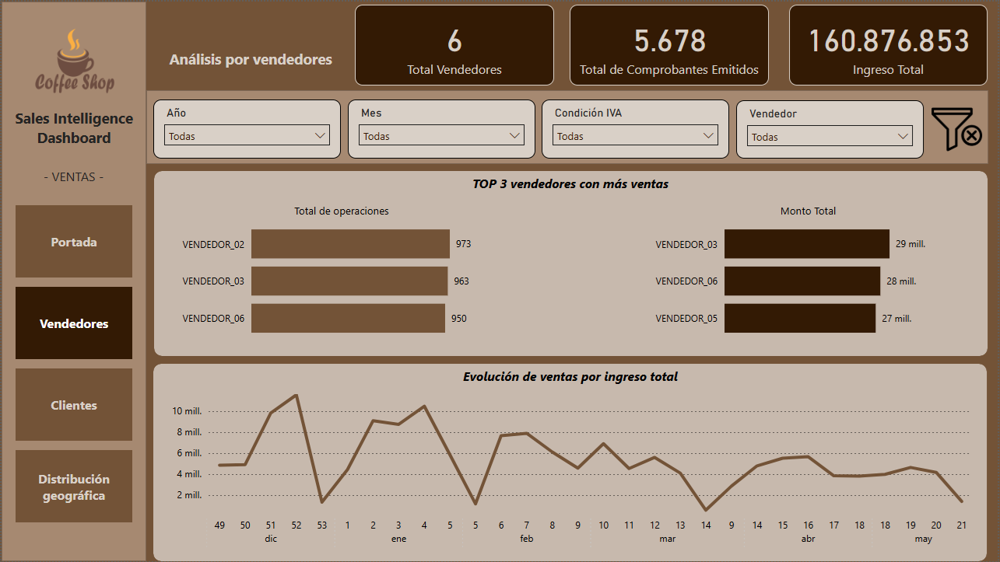
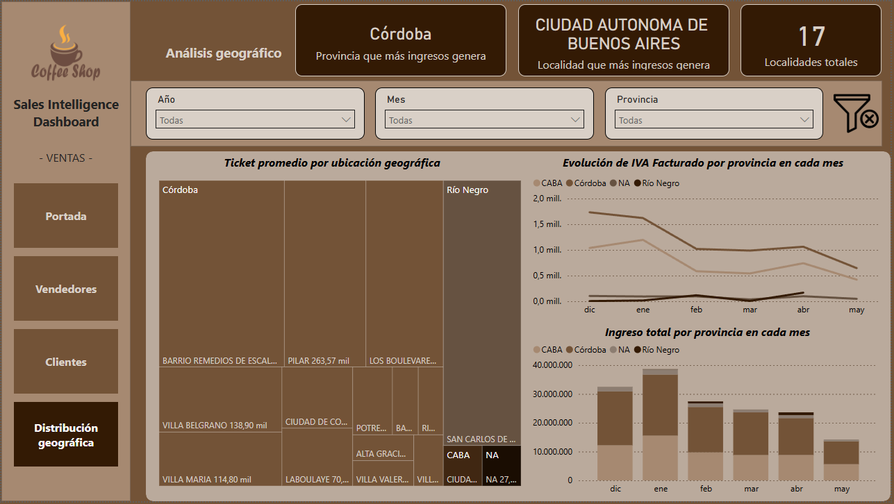

# Dashboard Business Intelligence

Dashboard interactivo desarrollado en Power BI para el análisis integral de clientes, vendedores, desempeño comercial y distribución geográfica de ingresos.

## 🎯 Objetivo

Transformar datos transaccionales en información accionable para facilitar la toma de decisiones comerciales mediante indicadores clave, análisis de clientes, desempeño de vendedores y monitoreo geográfico de ingresos.

## 🛠️ Herramientas utilizadas

* Power BI
* DAX
* Excel
* Modelado de datos
* Business Intelligence
* Data Visualization

## 📈 Indicadores principales

### Clientes

* Total de clientes
* Ticket promedio
* Top clientes por cantidad de operaciones
* Top clientes por ingresos
* Distribución por condición fiscal

### Ventas

* Total de comprobantes emitidos
* Ingresos totales
* IVA facturado
* Evolución mensual de ventas
* Evolución intermensual del negocio

### Vendedores

* Top 3 vendedores por cantidad de operaciones
* Top 3 vendedores por ingresos generados

### Análisis geográfico

* Ticket promedio por ubicación geográfica
* Evolución mensual del IVA facturado por provincia
* Evolución mensual de ingresos por provincia
* Provincia con mayor generación de ingresos
* Localidad con mayor generación de ingresos

## 🔍 Análisis incluidos

### Customer Analytics

Identificación de clientes estratégicos mediante análisis de frecuencia de compra, volumen de operaciones y generación de ingresos.

### Sales Performance

Monitoreo del desempeño comercial a través de indicadores de ventas, ticket promedio, facturación e impuestos generados.

### Sales Force Analytics

Evaluación comparativa de vendedores mediante indicadores de productividad y generación de ingresos.

### Geographic Intelligence

Análisis territorial para identificar provincias y localidades con mayor contribución al negocio, detectar oportunidades de expansión y monitorear tendencias regionales.

### Trend Analysis

Seguimiento de la evolución mensual de ventas e ingresos para detectar cambios en los patrones comerciales y apoyar la planificación estratégica.

## 💡 Valor para el negocio

Este dashboard permite:

* Identificar clientes de alto valor.
* Monitorear el desempeño comercial en tiempo real.
* Evaluar la productividad de vendedores.
* Analizar tendencias de ventas e ingresos.
* Detectar oportunidades comerciales por región.
* Facilitar la toma de decisiones basada en datos.
* Reducir tiempos de análisis mediante visualizaciones interactivas.

## 📂 Competencias demostradas

* Business Intelligence
* KPI Monitoring
* Customer Analytics
* Sales Analytics
* Geographic Analytics
* Data Visualization
* Dashboard Design
* DAX
* Data Modeling
* Financial & Commercial Analysis
* Decision Support
* Data Storytelling

## 🔒 Privacidad

Los datos utilizados en este repositorio fueron anonimizados con fines demostrativos. Los nombres de clientes, montos y referencias comerciales fueron modificados para preservar la confidencialidad de la información.

